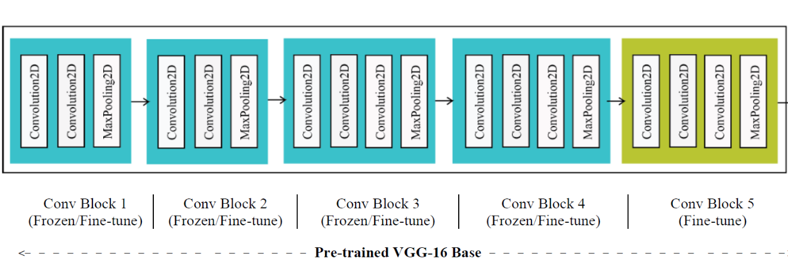

# CXR_C19_DS
### Chest X-Ray Covid-19 Detection System 

## Description
Covid-19 detection system using chest x-ray images based on transfer learning. We used [VGG-16](https://keras.io/api/applications/vgg/#vgg16-function) pre-trained model
and fine-tuning to adapt pre-trained model on our issue. We gained 90% accuracy after 55 epochs.

## Useful links
* Dataset: [COVID-19 Radiography Database](https://www.kaggle.com/tawsifurrahman/covid19-radiography-database)
* Trained model: [Download from google drive](https://drive.google.com/file/d/1PKdD3YDQVDrEgfDlvRhLW7Y4Qus3FTNn/view?usp=sharing)

## Authors
* Milad Sadeghi DM [@EverLookNeverSee](https://github.com/EverLookNeverSee)

## License
This project licensed under the **MIT License** - see the [LICENSE](LICENSE) file for more details.
